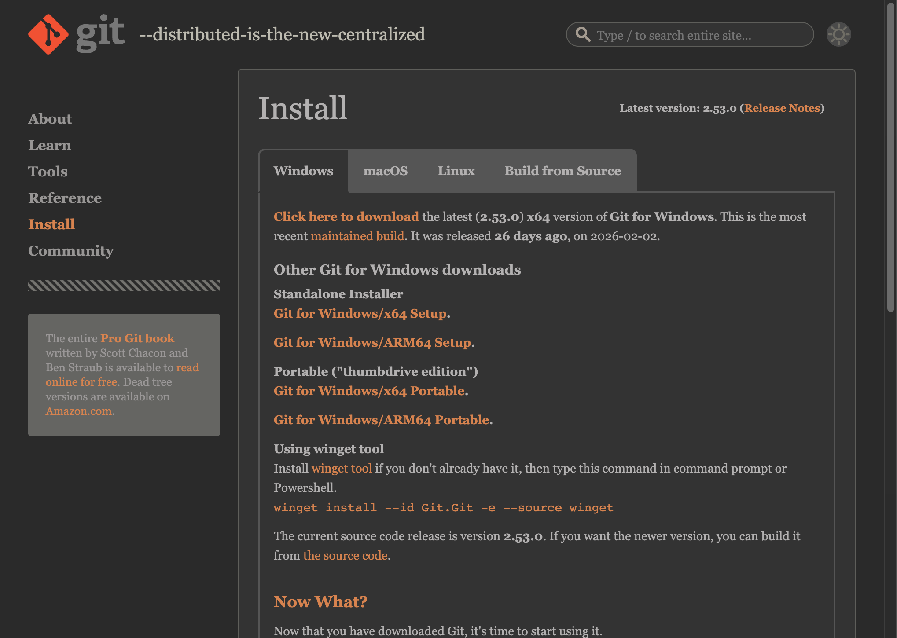
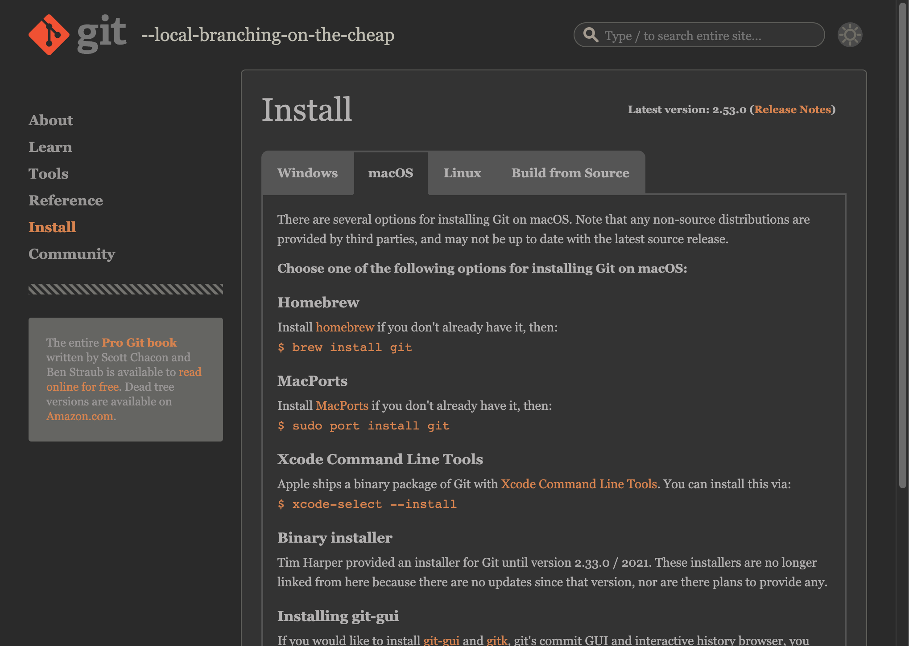
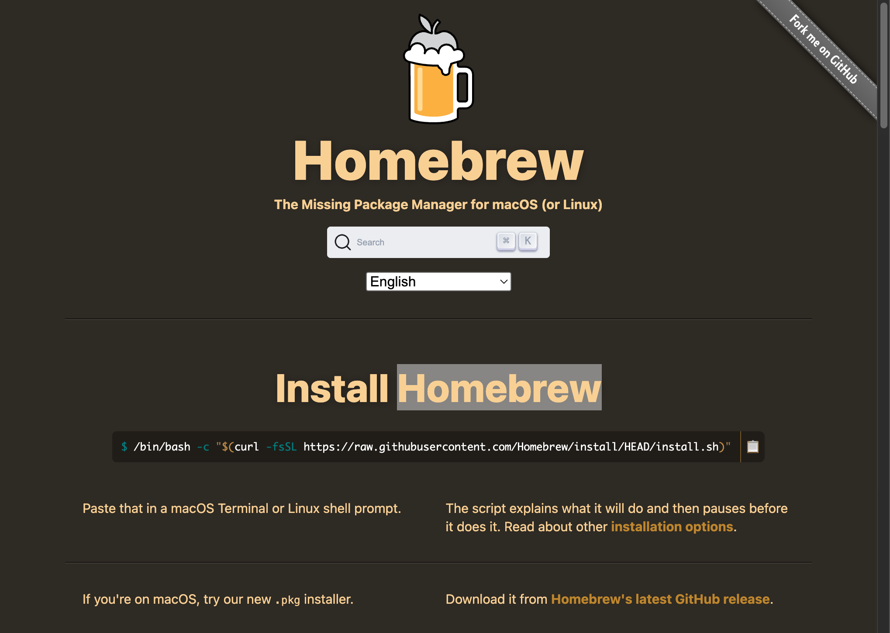
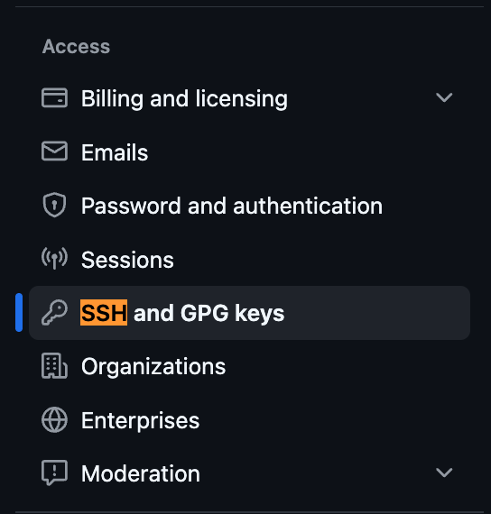

# Introduction to Git & GitHub

Panduan lengkap untuk memulai **version control** menggunakan Git dan GitHub, dari nol hingga bisa push code ke repository.

## Daftar Isi

1. [Apa itu Version Control?](#1-apa-itu-version-control)
2. [Apa itu Git dan GitHub?](#2-apa-itu-git-dan-github)
3. [Instalasi Git](#3-instalasi-git)
4. [Konfigurasi Awal Git](#4-konfigurasi-awal-git)
5. [Membuat Akun GitHub](#5-membuat-akun-github)
6. [Setup SSH Key](#6-setup-ssh-key)
7. [Konsep Dasar Git](#7-konsep-dasar-git)
8. [Repository Pertama (Praktik)](#8-repository-pertama-praktik)
9. [Menghubungkan dengan GitHub](#9-menghubungkan-dengan-github)
10. [File .gitignore](#10-file-gitignore)
11. [Branching Dasar](#11-branching-dasar)
12. [Pull Request di GitHub](#12-pull-request-di-github)
13. [Git vs Google Drive](#13-git-vs-google-drive)
14. [Tips dan Best Practices](#14-tips-dan-best-practices)
15. [Command Penting (Ringkasan)](#15-command-penting-ringkasan)
16. [Referensi](#16-referensi)

---

## 1. Apa itu Version Control?

Bayangkan kamu sedang mengerjakan tugas akhir, lalu menyimpan file seperti ini:

```
laporan_final.docx
laporan_final_v2.docx
laporan_final_v2_revisi.docx
laporan_final_FIX.docx
laporan_final_FIX_BENERAN.docx
```

Version control adalah sistem yang **mencatat setiap perubahan** pada file secara otomatis, sehingga kamu bisa:

- Melihat riwayat perubahan (siapa mengubah apa, kapan)
- Kembali ke versi sebelumnya jika ada kesalahan
- Bekerja bersama tim tanpa saling menimpa pekerjaan
- Membuat "cabang" percobaan tanpa merusak versi utama

Dalam data science, version control sangat penting untuk **reproducibility** — kamu bisa melacak versi code, dataset, dan experiment yang menghasilkan suatu model.

---

## 2. Apa itu Git dan GitHub?

### Git

Git adalah **version control system** (VCS) yang berjalan di komputer lokal. Git mencatat setiap perubahan pada file project kamu dalam bentuk *snapshot* (commit).

### GitHub

GitHub adalah **platform cloud** untuk menyimpan repository Git secara online. Dengan GitHub, kamu bisa:

- Backup code di cloud
- Kolaborasi dengan tim
- Showcase portfolio project
- Berkontribusi ke project open-source

> **Catatan**: Git dan GitHub adalah dua hal berbeda. Git = tools di komputer lokal. GitHub = layanan hosting di internet. Ada alternatif lain seperti GitLab dan Bitbucket, tapi GitHub paling populer.

---

## 3. Instalasi Git

### Windows



*Halaman download Git untuk Windows di [git-scm.com/downloads](https://git-scm.com/downloads)*

1. Download **Standalone Installer** dari [git-scm.com/downloads](https://git-scm.com/downloads)
2. Jalankan installer, gunakan setting default (klik Next terus)
3. Setelah install, buka **Git Bash** atau **Command Prompt**

> **Catatan**: Pilih **Standalone Installer**, bukan Portable. Standalone otomatis masuk PATH dan terintegrasi dengan Windows Explorer. Portable hanya untuk komputer yang tidak bisa install software (misal lab kampus).

Alternatif via command line (jika sudah punya `winget`):

```bash
$ winget install --id Git.Git -e --source winget
```

### Mac



*Halaman download Git untuk macOS di [git-scm.com/downloads](https://git-scm.com/downloads)*

Git biasanya sudah terinstall. Cek dulu:

```bash
$ git --version
```

Jika belum ada, install dengan salah satu cara:

**Cara 1: Homebrew (recommended)**



*Halaman [brew.sh](https://brew.sh) — package manager untuk macOS*

Jika belum punya Homebrew, install dulu:

```bash
$ /bin/bash -c "$(curl -fsSL https://raw.githubusercontent.com/Homebrew/install/HEAD/install.sh)"
```

Setelah Homebrew terinstall:

```bash
$ brew install git
```

**Cara 2: Xcode Command Line Tools**

```bash
$ xcode-select --install
```

### Linux (Ubuntu/Debian)

```bash
$ sudo apt update
$ sudo apt install git
```

### Verifikasi Instalasi

```bash
$ git --version
git version 2.47.1
```

Jika muncul nomor versi, Git sudah berhasil terinstall.

---

## 4. Konfigurasi Awal Git

Setelah install, kamu **wajib** mengatur identitas. Informasi ini akan muncul di setiap commit yang kamu buat.

```bash
# Set nama (gunakan nama asli)
$ git config --global user.name "Danish Rafie"

# Set email (gunakan email yang sama dengan akun GitHub)
$ git config --global user.email "danish@example.com"
```

### Konfigurasi Tambahan yang Disarankan

```bash
# Set default branch name ke "main" (standar modern, bukan "master")
$ git config --global init.defaultBranch main

# Set default editor (opsional, default: vim)
$ git config --global core.editor "code --wait"   # VS Code
$ git config --global core.editor "nano"           # Nano (lebih mudah)
```

### Cek Konfigurasi

```bash
# Lihat semua konfigurasi
$ git config --list

# Lihat konfigurasi spesifik
$ git config user.name
$ git config user.email
```

> **Catatan**: Flag `--global` artinya konfigurasi berlaku untuk semua repository di komputer. Jika ingin konfigurasi khusus untuk satu project, jalankan command tanpa `--global` di dalam folder project tersebut.

Sampai sini, Git sudah siap digunakan. Selanjutnya kita buat akun GitHub.

---

## 5. Membuat Akun GitHub

1. Buka [github.com](https://github.com) dan klik **Sign up**
2. Masukkan email, password, dan username
3. Verifikasi email

> **Tips**: Sebagai mahasiswa, kamu bisa mendaftar [GitHub Student Developer Pack](https://education.github.com/pack) untuk mendapatkan akses gratis ke berbagai tools premium (GitHub Copilot, domain gratis, cloud credits, dll). Daftar menggunakan email kampus.

---

## 6. Setup SSH Key

SSH key memungkinkan komputer kamu terhubung ke GitHub **tanpa perlu memasukkan password** setiap kali push/pull. Prosesnya: buat sepasang key (public + private), lalu simpan public key di GitHub.


*Ilustrasi: Public key disimpan di server (GitHub), private key tetap di komputer lokal. Keduanya digunakan untuk verifikasi identitas.*

### Langkah 1: Cek SSH Key yang Sudah Ada

```bash
$ ls -al ~/.ssh
```

Jika folder `~/.ssh` belum ada, kamu akan melihat:

```
ls: /Users/kamu/.ssh: No such file or directory
```

Itu normal — artinya belum pernah ada SSH key di komputer ini. Lanjut ke Langkah 2.

Jika sudah ada file `id_ed25519` dan `id_ed25519.pub`, kamu sudah punya SSH key. Lanjut ke [Langkah 4](#langkah-4-tambahkan-public-key-ke-github).

### Langkah 2: Generate SSH Key Baru

```bash
$ ssh-keygen -t ed25519 -C "emailkamu@example.com"
```

Saat diminta lokasi file, tekan **Enter** (gunakan default). Saat diminta passphrase, bisa dikosongkan (tekan Enter) atau isi untuk keamanan tambahan.

```
> Generating public/private ed25519 key pair.
> Enter file in which to save the key (/Users/kamu/.ssh/id_ed25519): [Enter]
> Enter passphrase (empty for no passphrase): [Enter]
> Enter same passphrase again: [Enter]
```

### Langkah 3: Tambahkan Key ke SSH Agent

#### Mac

```bash
# Start ssh-agent
$ eval "$(ssh-agent -s)"

# Buat/edit config file
$ touch ~/.ssh/config
```

Tambahkan isi berikut ke `~/.ssh/config`:

```
Host github.com
  AddKeysToAgent yes
  UseKeychain yes
  IdentityFile ~/.ssh/id_ed25519
```

Lalu tambahkan key:

```bash
$ ssh-add --apple-use-keychain ~/.ssh/id_ed25519
```

#### Windows (Git Bash)

```bash
$ eval "$(ssh-agent -s)"
$ ssh-add ~/.ssh/id_ed25519
```

#### Linux

```bash
$ eval "$(ssh-agent -s)"
$ ssh-add ~/.ssh/id_ed25519
```

### Langkah 4: Tambahkan Public Key ke GitHub

1. Copy public key ke clipboard:

```bash
# Mac
$ pbcopy < ~/.ssh/id_ed25519.pub

# Windows (Git Bash)
$ clip < ~/.ssh/id_ed25519.pub

# Linux
$ cat ~/.ssh/id_ed25519.pub
# Lalu copy output-nya secara manual
```

2. Buka GitHub: **Settings** > **SSH and GPG keys** > **New SSH key**



*Lokasi menu SSH and GPG keys di GitHub Settings*

3. Beri judul (contoh: "Laptop Pribadi"), paste key, klik **Add SSH key**

### Langkah 5: Test Koneksi

```bash
$ ssh -T git@github.com
Hi username! You've successfully authenticated, but GitHub does not provide shell access.
```

Jika muncul pesan seperti di atas, SSH key berhasil terhubung.

Sampai sini, komputer kamu sudah terhubung dengan GitHub secara aman. Selanjutnya kita pelajari konsep dasar Git.

---

## 7. Konsep Dasar Git

### Tiga Area Utama

Git bekerja dengan **tiga area** yang perlu kamu pahami:


*Sumber: [Pro Git Book](https://git-scm.com/book/en/v2/Getting-Started-What-is-Git%3F)*

| Area | Penjelasan |
|---|---|
| **Working Directory** | Folder project di komputer kamu. Tempat kamu mengedit file seperti biasa |
| **Staging Area** | Area persiapan. File yang sudah di-`git add` masuk ke sini, menandakan file siap di-commit |
| **Repository (.git)** | Database Git yang menyimpan seluruh riwayat commit. Tersimpan di folder `.git/` |

Alur kerjanya:

```
Edit file  ──>  git add  ──>  git commit
(Working)      (Staging)     (Repository)
```

### Siklus Hidup File di Git

Setiap file dalam repository Git memiliki salah satu dari empat status berikut:


*Sumber: [Pro Git Book](https://git-scm.com/book/en/v2/Git-Basics-Recording-Changes-to-the-Repository)*

| Status | Artinya |
|---|---|
| **Untracked** | File baru yang belum pernah di-`git add`. Git tidak melacak file ini |
| **Unmodified** | File yang sudah di-commit dan belum diubah |
| **Modified** | File yang sudah diubah tapi belum di-stage |
| **Staged** | File yang sudah di-`git add` dan siap di-commit |

> **Penting**: Memahami tiga area dan siklus hidup file ini adalah kunci untuk mengerti Git. Jika konsep ini sudah jelas, command-command selanjutnya akan jauh lebih mudah dipahami.

---

## 8. Repository Pertama (Praktik)

Mari langsung praktik membuat repository Git pertama.

### Langkah 1: Buat Folder Project

```bash
$ mkdir belajar-git
$ cd belajar-git
```

### Langkah 2: Inisialisasi Git

```bash
$ git init
Initialized empty Git repository in /Users/kamu/belajar-git/.git/
```

Command ini membuat folder `.git/` tersembunyi yang berisi database Git.

### Langkah 3: Buat File Pertama

```bash
$ echo "# Belajar Git" > README.md
```

### Langkah 4: Cek Status

```bash
$ git status
On branch main
No commits yet
Untracked files:
  (use "git add <file>..." to include in what will be committed)
        README.md

nothing added to commit but untracked files present (use "git add" to track)
```

Git memberi tahu bahwa `README.md` adalah **untracked file** — belum dilacak.

### Langkah 5: Tambahkan ke Staging Area

```bash
# Tambah satu file
$ git add README.md

# Atau tambah semua file sekaligus
$ git add .
```

Cek lagi:

```bash
$ git status
On branch main
No commits yet
Changes to be committed:
  (use "git rm --cached <file>..." to unstage)
        new file:   README.md
```

File sudah berpindah ke **staging area** (siap di-commit).

### Langkah 6: Commit

```bash
$ git commit -m "Initial commit: tambah README"
[main (root-commit) 7a3b2c1] Initial commit: tambah README
 1 file changed, 1 insertion(+)
 create mode 100644 README.md
```

### Langkah 7: Lihat Riwayat

```bash
$ git log
commit 7a3b2c1... (HEAD -> main)
Author: Danish Rafie <danish@example.com>
Date:   Fri Feb 28 2026

    Initial commit: tambah README
```

Untuk tampilan lebih ringkas:

```bash
$ git log --oneline
7a3b2c1 Initial commit: tambah README
```

Sampai sini kamu sudah berhasil membuat repository Git lokal dan melakukan commit pertama. Selanjutnya kita hubungkan dengan GitHub.

---

## 9. Menghubungkan dengan GitHub

Ada dua cara:
- **Cara A**: Buat repo lokal dulu, lalu push ke GitHub (yang sudah kita lakukan di atas)
- **Cara B**: Buat repo di GitHub dulu, lalu clone ke lokal

### Cara A: Push Repo Lokal ke GitHub

1. Buat **repository baru** di GitHub:
   - Buka [github.com/new](https://github.com/new)
   - Isi nama repository (contoh: `belajar-git`)
   - Jangan centang "Add a README" (karena sudah ada di lokal)
   - Klik **Create repository**

2. Hubungkan dan push:

```bash
# Tambahkan remote (alamat GitHub)
$ git remote add origin git@github.com:username/belajar-git.git

# Push ke GitHub (-u artinya set upstream, cukup sekali)
$ git push -u origin main
```

3. Refresh halaman GitHub — file kamu sudah muncul.

### Cara B: Clone Repo dari GitHub

Jika repo sudah ada di GitHub dan kamu ingin download ke lokal:

```bash
$ git clone git@github.com:username/belajar-git.git
$ cd belajar-git
```

### Sinkronisasi Sehari-hari

```bash
# Upload perubahan lokal ke GitHub
$ git push

# Download perubahan dari GitHub ke lokal
$ git pull
```

> **Tips**: Biasakan `git pull` dulu sebelum mulai bekerja, agar lokal selalu up-to-date — terutama jika bekerja dalam tim.

---

## 10. File .gitignore

Tidak semua file perlu di-track oleh Git. File yang **tidak boleh** masuk repository:

- File hasil generate (cache, bytecode)
- File berisi data sensitif (password, API key)
- File dataset besar
- File environment (virtual environment folder)

### Membuat .gitignore

Buat file `.gitignore` di root folder project:

```bash
$ touch .gitignore
```

### Contoh .gitignore untuk Python / Data Science

```gitignore
# Byte-compiled / cache
__pycache__/
*.py[cod]
*.pyc

# Virtual environment
myenv/
venv/
.venv/
env/

# Jupyter Notebook checkpoints
.ipynb_checkpoints/

# IDE settings
.vscode/
.idea/

# OS files
.DS_Store
Thumbs.db

# Environment variables / secrets
.env
*.key
credentials.json

# Data files (jika terlalu besar)
*.csv
*.xlsx
*.pkl
*.h5
data/

# Model files
*.joblib
*.model
```

### Aturan Pattern .gitignore

| Pattern | Artinya |
|---|---|
| `*.pyc` | Ignore semua file berekstensi `.pyc` |
| `__pycache__/` | Ignore folder `__pycache__` |
| `!important.csv` | Kecualikan file ini (jangan ignore) |
| `/TODO` | Ignore file `TODO` hanya di root, bukan `subdir/TODO` |
| `data/**/*.csv` | Ignore semua `.csv` di folder `data/` dan subfolder-nya |

> **Penting**: Buat `.gitignore` **sebelum** commit pertama. Jika sudah terlanjur commit file yang seharusnya di-ignore, kamu perlu menghapusnya dari tracking: `git rm --cached <file>`

> **Tips**: GitHub menyediakan template `.gitignore` untuk berbagai bahasa di [github.com/github/gitignore](https://github.com/github/gitignore). Template Python bisa langsung digunakan.

---

## 11. Branching Dasar

Branch memungkinkan kamu membuat "cabang" dari code utama untuk mengerjakan fitur baru atau eksperimen, **tanpa mengganggu** code yang sudah berjalan.

### Kenapa Perlu Branch?

- Mengerjakan fitur baru tanpa merusak `main`
- Eksperimen model ML tanpa kehilangan versi sebelumnya
- Kolaborasi tim — setiap orang kerja di branch sendiri

### Visualisasi Branch


*Sumber: [Pro Git Book](https://git-scm.com/book/en/v2/Git-Branching-Basic-Branching-and-Merging). Terlihat branch `iss53` dan `hotfix` dibuat dari `master` dan berkembang secara independen.*

### Command Branch

```bash
# Lihat semua branch (tanda * = branch aktif)
$ git branch
* main

# Buat branch baru
$ git branch fitur-eda

# Pindah ke branch tersebut
$ git switch fitur-eda
# atau (cara lama): git checkout fitur-eda

# Shortcut: buat + pindah sekaligus
$ git switch -c fitur-eda
# atau: git checkout -b fitur-eda
```

### Merge (Menggabungkan Branch)

Setelah selesai mengerjakan fitur di branch, gabungkan kembali ke `main`:

```bash
# Pindah ke branch tujuan (main)
$ git switch main

# Merge branch fitur ke main
$ git merge fitur-eda
```


*Sumber: [Pro Git Book](https://git-scm.com/book/en/v2/Git-Branching-Basic-Branching-and-Merging). Setelah merge, commit dari branch `iss53` sudah tergabung ke `master`.*

### Hapus Branch yang Sudah Di-merge

```bash
$ git branch -d fitur-eda
```

> **Tips**: Biasakan memberi nama branch yang deskriptif, misalnya: `fitur-cleaning`, `fix-bug-missing-values`, `eksperimen-random-forest`.

---

## 12. Pull Request di GitHub

Pull Request (PR) adalah cara untuk **mengusulkan perubahan** dari satu branch ke branch lain di GitHub. PR sangat penting untuk kolaborasi tim karena memungkinkan review code sebelum di-merge.

### Alur Pull Request


*Sumber: [Nulab Git Tutorial](https://nulab.com/learn/software-development/git-tutorial/git-collaboration/reviewing-changes/pull-requests-workflow/)*

### Langkah-langkah Membuat PR

1. **Buat branch** dan commit perubahan:

```bash
$ git switch -c fitur-visualisasi
# ... edit file, tambah visualisasi ...
$ git add .
$ git commit -m "Tambah visualisasi distribusi data"
$ git push -u origin fitur-visualisasi
```

2. **Buka GitHub** — akan muncul tombol **"Compare & pull request"**

3. **Isi deskripsi PR**:
   - Judul yang jelas (contoh: "Tambah visualisasi distribusi data")
   - Deskripsi perubahan yang dilakukan
   - Screenshot jika ada perubahan visual

4. **Klik "Create pull request"**

5. **Review dan merge**:
   - Reviewer bisa memberikan komentar
   - Setelah di-approve, klik **"Merge pull request"**
   - Branch bisa dihapus setelah merge

### GitHub Flow

GitHub Flow adalah workflow sederhana yang direkomendasikan:

```
main ─────────────────────────────────────────── (selalu stable)
  \                                          /
   └── fitur-branch ── commit ── commit ── PR ── merge
```

1. Buat branch dari `main`
2. Commit perubahan di branch tersebut
3. Push branch ke GitHub
4. Buat Pull Request
5. Review dan diskusi
6. Merge ke `main`
7. Hapus branch

---

## 13. Git vs Google Drive

Kenapa tidak pakai Google Drive atau Dropbox saja untuk menyimpan code?

| | Git + GitHub | Google Drive / Dropbox |
|---|---|---|
| **Riwayat perubahan** | Setiap commit tercatat detail (siapa, kapan, apa yang berubah, kenapa) | Hanya "version history" kasar, tidak detail |
| **Kolaborasi** | Branch terpisah, merge terkontrol, review via PR | Bisa overwrite pekerjaan orang lain |
| **Rollback** | Bisa kembali ke commit manapun dengan presisi | Terbatas, history bisa hilang |
| **Branching** | Bisa buat banyak versi paralel (eksperimen A, B, C) | Tidak ada konsep branching |
| **Code review** | Pull Request + inline comments | Tidak tersedia |
| **Offline** | Semua riwayat ada di lokal | Butuh internet |
| **File besar** | Tidak cocok untuk file besar (dataset, model) | Cocok untuk file besar |
| **Otomatis** | Perlu manual `add`, `commit`, `push` | Auto-sync |

> **Catatan**: Untuk **dataset besar** dan file non-code, Google Drive/cloud storage tetap pilihan yang tepat. Git paling cocok untuk **source code**, notebook, dan file konfigurasi.

---

## 14. Tips dan Best Practices

### Commit Message yang Baik

```bash
# Baik - jelas dan spesifik
$ git commit -m "Tambah fungsi cleaning missing values pada kolom numerik"
$ git commit -m "Fix bug: handle NaN pada kolom kategorikal"
$ git commit -m "Update requirements.txt: tambah seaborn 0.13.2"

# Buruk - tidak informatif
$ git commit -m "update"
$ git commit -m "fix"
$ git commit -m "done"
$ git commit -m "asdfgh"
```

Konvensi yang umum dipakai:

| Prefix | Kegunaan | Contoh |
|---|---|---|
| `Add` | Fitur/file baru | `Add visualisasi correlation heatmap` |
| `Fix` | Perbaikan bug | `Fix error pada handling missing values` |
| `Update` | Perubahan existing | `Update versi library di requirements.txt` |
| `Remove` | Hapus file/fitur | `Remove unused data preprocessing script` |
| `Refactor` | Perbaikan struktur code | `Refactor fungsi cleaning jadi modular` |

### Hal yang Harus Dihindari

- Jangan commit file sensitif (password, API key, `.env`)
- Jangan commit dataset besar (gunakan `.gitignore`)
- Jangan commit langsung ke `main` jika kerja dalam tim — selalu lewat branch + PR
- Jangan lupa `git pull` sebelum mulai bekerja

### Kapan Harus Commit?

- Setiap kali menyelesaikan satu unit perubahan yang logis
- Sebelum mulai eksperimen yang mungkin merusak code
- Di akhir sesi kerja

> **Tips**: Lebih baik commit **sering dengan perubahan kecil** daripada commit **jarang dengan perubahan besar**. Ini memudahkan tracking dan rollback jika ada masalah.

---

## 15. Command Penting (Ringkasan)

```bash
# === SETUP ===
git config --global user.name "Nama Kamu"
git config --global user.email "email@example.com"
git config --global init.defaultBranch main
git config --list                          # Cek semua konfigurasi

# === SSH ===
ssh-keygen -t ed25519 -C "email@example.com"   # Generate SSH key
ssh-add ~/.ssh/id_ed25519                       # Tambah ke agent
ssh -T git@github.com                           # Test koneksi

# === REPOSITORY ===
git init                                   # Buat repo baru
git clone git@github.com:user/repo.git     # Clone repo dari GitHub

# === WORKFLOW HARIAN ===
git status                                 # Cek status file
git add <file>                             # Stage file tertentu
git add .                                  # Stage semua perubahan
git commit -m "pesan commit"               # Commit dengan pesan
git push                                   # Upload ke GitHub
git pull                                   # Download dari GitHub

# === RIWAYAT ===
git log                                    # Lihat riwayat commit
git log --oneline                          # Riwayat ringkas
git diff                                   # Lihat perubahan yang belum di-stage
git diff --staged                          # Lihat perubahan yang sudah di-stage

# === BRANCHING ===
git branch                                 # Lihat semua branch
git switch -c nama-branch                  # Buat + pindah ke branch baru
git switch main                            # Pindah ke branch main
git merge nama-branch                      # Gabungkan branch ke branch aktif
git branch -d nama-branch                  # Hapus branch

# === REMOTE ===
git remote add origin <url>                # Hubungkan ke GitHub
git remote -v                              # Lihat remote yang terhubung
git push -u origin main                    # Push pertama kali
git push -u origin nama-branch             # Push branch baru

# === UNDO ===
git restore <file>                         # Batalkan perubahan (belum di-stage)
git restore --staged <file>                # Unstage file
git rm --cached <file>                     # Hapus dari tracking (file tetap ada)
```

---

## 16. Referensi

- [Pro Git Book](https://git-scm.com/book/en/v2) — Buku Git resmi, gratis dan lengkap
- [GitHub Docs: Get Started](https://docs.github.com/en/get-started) — Dokumentasi resmi GitHub
- [GitHub Skills](https://skills.github.com/) — Tutorial interaktif langsung di GitHub
- [GitHub Student Developer Pack](https://education.github.com/pack) — Tools gratis untuk mahasiswa
- [gitignore Templates](https://github.com/github/gitignore) — Template .gitignore untuk berbagai bahasa
- [Atlassian Git Tutorials](https://www.atlassian.com/git/tutorials) — Tutorial visual yang bagus
