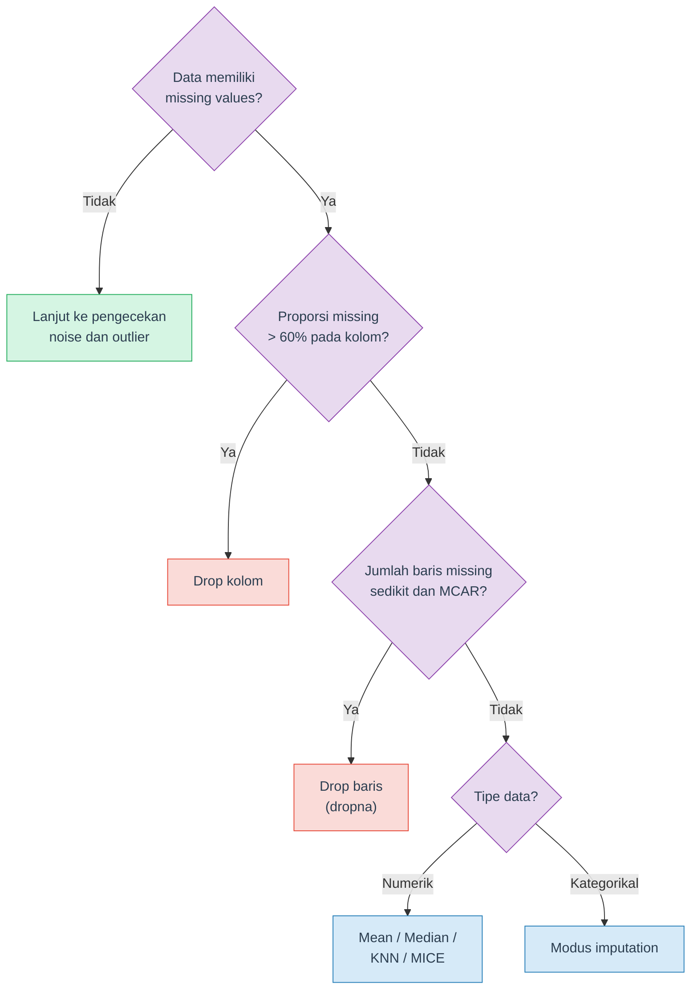
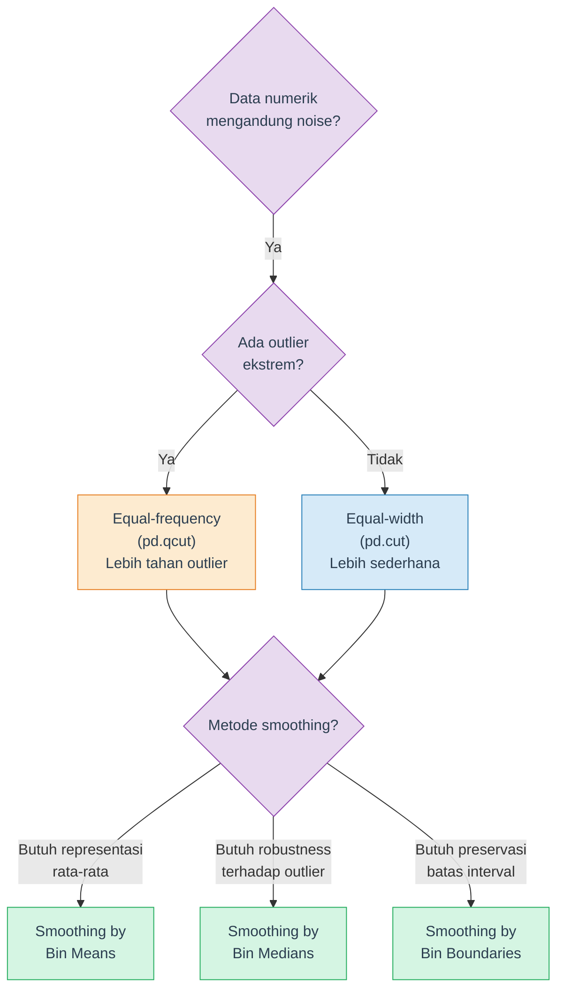
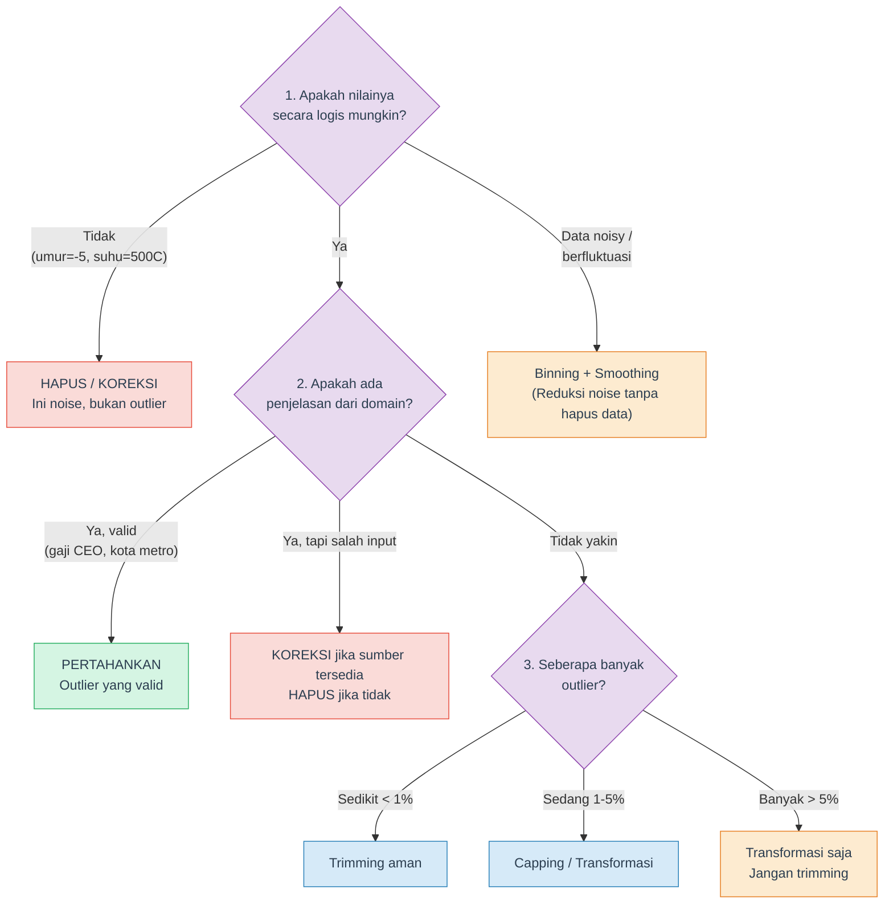

# Data Cleaning: Noisy Data dan Outlier

Materi deteksi dan penanganan **noisy data** serta **outlier** — melengkapi materi Teknik Sampling dan Data Wrangling.

## Tujuan Pembelajaran

Setelah mempelajari materi ini, mahasiswa diharapkan mampu:

- Membedakan noise, outlier, dan anomaly
- Mendeteksi outlier menggunakan metode IQR, Z-Score, dan Modified Z-Score
- Menerapkan teknik binning dan smoothing untuk mengurangi noise
- Memilih strategi handling outlier yang tepat (capping, trimming, transformasi)
- Mengevaluasi dampak data cleaning pada statistik deskriptif

## Daftar Isi

1. [Recap: Missing Values](#1-recap-missing-values)
2. [Noisy Data](#2-noisy-data)
3. [Deteksi Outlier](#3-deteksi-outlier)
4. [Binning dan Smoothing](#4-binning-dan-smoothing)
5. [Handling Outlier](#5-handling-outlier)
6. [Kapan Outlier Dibuang vs Dipertahankan?](#6-kapan-outlier-dibuang-vs-dipertahankan)
7. [Dampak Cleaning pada Statistik Deskriptif](#7-dampak-cleaning-pada-statistik-deskriptif)
8. [Data Cleaning sebagai Proses](#8-data-cleaning-sebagai-proses)
9. [Ringkasan dan Cheatsheet](#9-ringkasan-dan-cheatsheet)
10. [Tugas dan Latihan](#10-tugas-dan-latihan)
11. [Referensi](#11-referensi)

---

## 1. Recap: Missing Values

Pada mata kuliah **Teknik Sampling dan Data Wrangling** (Modul 5), kalian sudah mempelajari cara menangani missing values secara mendalam. Berikut ringkasan singkat sebagai pengingat.

### Jenis Missing Values

| Jenis | Penjelasan | Contoh |
|---|---|---|
| MCAR (Missing Completely at Random) | Data hilang secara acak total — tidak ada pola, murni kebetulan | Sensor mati karena listrik padam |
| MAR (Missing at Random) | Data hilang karena dipengaruhi variabel lain yang kita punya | Mahasiswa malas isi survei jika IPK rendah |
| MNAR (Missing Not at Random) | Data hilang justru karena nilai itu sendiri — ada alasan tersembunyi | Orang berpenghasilan tinggi tidak mengisi kolom gaji |

### Flowchart Penanganan



Jangan lupa cek duplikat juga: `df.duplicated().sum()` lalu `df.drop_duplicates()`.

> **Catatan**: Detail tentang missing values — deteksi dengan `missingno`, KNN Imputer, MICE/IterativeImputer, perbandingan visual antar metode imputasi — sudah dibahas lengkap di materi Teknik Sampling dan Data Wrangling (Modul 5). Materi ini tidak mengulang topik tersebut.

> **Awas: Disguised Missing Data** — Tidak semua missing values tampil sebagai `NaN`:
>
> - User mengisi data palsu pada field wajib (tanggal lahir default "1 Januari 2000", pendapatan "0")
> - Data terlihat valid secara format, tapi tidak informatif
> - Deteksi: gunakan domain knowledge + cek distribusi (Han et al., 2023)

---

## 2. Noisy Data

### Apa itu Noise?

**Noise** (data kotor/berisik) adalah kesalahan atau variasi acak dalam data yang **tidak membawa informasi berguna**. Noise mengaburkan pola sebenarnya dan bisa menyesatkan analisis maupun model machine learning.


Contoh noise dalam kehidupan nyata:

- Umur tercatat **-5 tahun** (tidak mungkin)
- Gaji tercatat **Rp 999.999.999.999** padahal data karyawan biasa
- Suhu tubuh tercatat **200 derajat Celsius** karena sensor rusak
- Nama kota ditulis "Surabya" (typo dari "Surabaya")

### Noise vs Outlier vs Anomaly

Tiga istilah ini sering tertukar. Berikut perbedaannya:

| Aspek | Noise | Outlier | Anomaly |
|---|---|---|---|
| **Definisi** | Error atau variasi acak | Nilai yang jauh berbeda dari mayoritas | Pola langka yang nyata ada |
| **Penyebab** | Kesalahan input, sensor rusak | Bisa error ATAU fenomena nyata | Fenomena nyata yang jarang terjadi |
| **Informasi** | Tidak ada — harus dihilangkan | Perlu investigasi dulu | Ada — justru dicari |
| **Contoh** | Umur = -5 tahun | Gaji CEO = 50 miliar (di data karyawan) | Transaksi fraud di antara jutaan transaksi normal |
| **Aksi** | Selalu bersihkan | Tergantung konteks dan domain | Pertahankan dan analisis lebih lanjut |

> **Penting**: Tidak semua outlier adalah noise. Gaji CEO 100x karyawan lain = outlier **valid**. Umur = -5 tahun = noise **jelas**. Statistik saja tidak cukup — butuh **domain knowledge**.

<details>
<summary><b>Cek Pemahaman</b>: Dalam dataset transaksi bank, ditemukan satu transaksi senilai Rp 500 juta di antara ribuan transaksi rata-rata Rp 500 ribu. Noise, outlier, atau anomaly?</summary>

Jawabannya: **tergantung konteks**. Bisa jadi **outlier** yang valid (transfer pembelian rumah), bisa jadi **anomaly** (indikasi fraud yang perlu diinvestigasi), atau bisa juga **noise** (kesalahan input yang seharusnya Rp 500 ribu). Inilah mengapa **domain knowledge** sangat penting dalam data cleaning — statistik saja tidak cukup.

</details>

### Sumber Noise

| Sumber | Contoh | Cara Deteksi |
|---|---|---|
| Human error | Salah ketik: gaji "50000" menjadi "500000" | Cek range, distribusi |
| Sensor/alat ukur | Termometer rusak melaporkan suhu 200 derajat Celsius | Cek nilai di luar batas fisik |
| Data collection | Web scraping menangkap header tabel sebagai baris data | Inspeksi manual baris pertama/terakhir |
| Encoding/format | Tanggal "01/02/2024" — Januari atau Februari? | Cek konsistensi format |
| Merge/integration | Duplikat muncul dari join dua sumber data berbeda | `df.duplicated()` |

---

## 3. Deteksi Outlier

Ada dua pendekatan utama: **metode statistik** (kuantitatif, menghasilkan threshold angka) dan **metode visual** (kualitatif, menggunakan grafik). Sebaiknya kombinasikan keduanya.

Semua contoh di bawah menggunakan dataset yang sama:

```python
import numpy as np
import pandas as pd

data = pd.Series([15, 18, 19, 20, 21, 22, 22, 25, 42, 100])
```

### 3.1 Metode IQR (Interquartile Range)

IQR mengukur sebaran data pada **50% tengah** (antara kuartil pertama dan kuartil ketiga). Metode ini **non-parametrik** — tidak mengasumsikan distribusi tertentu — sehingga cocok untuk data yang tidak normal (skewed).

**Rumus:**

$$IQR = Q3 - Q1$$

$$\text{Batas bawah} = Q1 - 1.5 \times IQR$$

$$\text{Batas atas} = Q3 + 1.5 \times IQR$$

Data di luar kedua batas tersebut dianggap **outlier**. Jika menggunakan faktor **3.0** (bukan 1.5), data disebut **extreme outlier**.

```python
Q1, Q3 = data.quantile(0.25), data.quantile(0.75)
IQR = Q3 - Q1
batas_bawah, batas_atas = Q1 - 1.5 * IQR, Q3 + 1.5 * IQR
outliers = data[(data < batas_bawah) | (data > batas_atas)]
```

Hasil: Q1=19.25, Q3=24.25, IQR=5.0, batas=[11.75, 31.75] → outlier: **42, 100**.

### 3.2 Z-Score

Z-score mengukur **berapa standar deviasi** suatu data point jauhnya dari mean.

**Rumus:**

$$z = \frac{x - \mu}{\sigma}$$

Aturan umum: data dengan $|z| > 3$ dianggap outlier.

```python
from scipy import stats
z_scores = stats.zscore(data)
outliers = data[np.abs(z_scores) > 3]
```

Hasil: **tidak ada outlier terdeteksi** (z-score 100 hanya 2.87). Ini disebut **masking effect** — outlier menaikkan mean (21→30.4) dan menggembungkan std (→24.2), sehingga z-score-nya "tersamarkan".

> **Catatan**: Z-score mengasumsikan distribusi **normal** dan sensitif terhadap outlier (karena menggunakan mean dan std). Untuk data kecil atau skewed, gunakan Modified Z-score.

### 3.3 Modified Z-Score (MAD)

Modified Z-score menggunakan **median** dan **MAD** (Median Absolute Deviation) sebagai pengganti mean dan std, sehingga **jauh lebih robust** terhadap outlier.

**Rumus:**

$$MAD = \text{median}(|x_i - \text{median}(x)|)$$

$$M_i = \frac{0.6745 \times (x_i - \text{median}(x))}{MAD}$$

Konstanta 0.6745 membuat MAD setara dengan standar deviasi pada distribusi normal. Threshold: data dengan $|M_i| > 3.5$ dianggap outlier (Iglewicz & Hoaglin, 1993).

```python
median = data.median()
mad = np.median(np.abs(data - median))
modified_z = 0.6745 * (data - median) / mad
outliers = data[np.abs(modified_z) > 3.5]
```

Hasil: median=21.5, MAD=3.0 → outlier: **42** (Mz=4.61) dan **100** (Mz=17.65). Berhasil mendeteksi kedua outlier yang dilewatkan Z-score karena median dan MAD **tidak terpengaruh** nilai ekstrem.

### 3.4 Perbandingan Metode Deteksi

| Metode | Asumsi | Robust terhadap Outlier? | Kapan Digunakan |
|---|---|---|---|
| IQR | Tidak ada (non-parametrik) | Ya | Data skewed, tidak normal, dataset kecil |
| Z-Score | Distribusi normal | Tidak (masking effect) | Data besar, distribusi mendekati normal |
| Modified Z-Score | Tidak ada | Ya (paling robust) | Data kecil/sedang, ada dugaan outlier banyak |

> **Tips**: Jika ragu, mulai dengan **Modified Z-score** atau **IQR**. Z-score biasa hanya reliable jika datanya besar (n > 100) dan distribusinya mendekati normal.


### 3.5 Metode Visual

Selain metode statistik, visualisasi membantu mengidentifikasi outlier secara intuitif.

#### Boxplot

Menampilkan IQR, median, whisker (1.5x IQR), dan titik outlier secara otomatis. Titik di luar whisker = outlier.


#### Histogram

Distribusi frekuensi — outlier terlihat sebagai bar terisolasi jauh dari kelompok utama.


#### Scatter Plot

Melihat outlier dalam konteks **dua variabel** sekaligus. Tambahkan garis batas IQR untuk memperjelas threshold.


> **Tips**: Dalam praktik, gunakan **kombinasi** metode statistik dan visual. Metode statistik memberikan threshold yang objektif, sedangkan visual membantu memahami *konteks* dan *pola* outlier.

> **Metode lain**: Selain metode statistik di atas, outlier juga bisa dideteksi menggunakan **clustering** — nilai yang tidak termasuk dalam cluster manapun dianggap sebagai outlier (Han et al., 2023). Teknik ini akan dibahas lebih lanjut di materi Unsupervised Learning (Week 9-10).

<details>
<summary><b>Cek Pemahaman</b>: Mengapa Z-score bisa gagal mendeteksi outlier pada dataset kecil?</summary>

Karena Z-score menggunakan **mean** dan **standar deviasi**, yang keduanya sensitif terhadap nilai ekstrem. Outlier menaikkan mean dan menggembungkan std, sehingga z-score outlier itu sendiri menjadi lebih kecil — efek ini disebut **masking**. Modified Z-score menggunakan median dan MAD yang tidak terpengaruh oleh outlier, sehingga lebih robust.

</details>

---

## 4. Binning dan Smoothing

**Binning** membagi data menjadi kelompok-kelompok (bin), lalu **smoothing** menghaluskan nilai dalam tiap bin untuk mengurangi noise. Metode non-parametrik dari Han et al.

### Flowchart Binning dan Smoothing



### Dua Jenis Binning

Contoh data (Han et al., 2023): `[4, 8, 15, 21, 21, 24, 25, 28, 34]`

| Jenis | Cara Kerja | Fungsi pandas | Keterangan |
|---|---|---|---|
| **Equal-width** | Bagi range menjadi interval **lebar sama** | `pd.cut(data, bins=3)` | Sensitif terhadap outlier (range ditentukan min/max) |
| **Equal-frequency** | Bagi agar tiap bin berisi **jumlah data sama** | `pd.qcut(data, q=3)` | Lebih tahan outlier, lebar interval bervariasi |

Equal-frequency dengan depth=3: Bin 1: [4, 8, 15], Bin 2: [21, 21, 24], Bin 3: [25, 28, 34]

### Tiga Metode Smoothing

Setelah dibagi ke bin, smoothing mengganti nilai dalam tiap bin untuk mengurangi noise:

| Metode | Ganti dengan | Contoh Bin [4, 8, 15] | Kelebihan |
|---|---|---|---|
| **Bin Means** | Mean bin | → [9, 9, 9] | Representatif, paling sering digunakan |
| **Bin Medians** | Median bin | → [8, 8, 8] | Robust terhadap outlier dalam bin |
| **Bin Boundaries** | Batas terdekat (min/max) | → [4, 4, 15] | Mempertahankan batas interval |


> **Metode smoothing lain**: **Regression** juga bisa digunakan untuk smoothing — data difit ke fungsi (misal garis linear). Dibahas di materi Supervised Learning.

> **Implementasi lengkap**: Lihat notebook [`praktikum/Data-Cleaning.ipynb`](praktikum/Data-Cleaning.ipynb) Section 7 untuk kode binning dan smoothing.

<details>
<summary><b>Cek Pemahaman</b>: Apa perbedaan utama antara equal-width dan equal-frequency binning?</summary>

**Equal-width** membagi berdasarkan range (lebar interval sama), sehingga jumlah data per bin bisa tidak merata — terutama jika ada outlier. **Equal-frequency** membagi berdasarkan jumlah data (setiap bin berisi jumlah data yang sama), sehingga lebih tahan terhadap outlier tapi lebar intervalnya bervariasi.

</details>

---

## 5. Handling Outlier

Setelah outlier terdeteksi, ada beberapa cara menanganinya. Pilihan metode tergantung pada konteks data dan tujuan analisis.

### 5.1 Capping (Winsorization)

Ganti nilai outlier dengan **batas atas/bawah** yang ditentukan. Data tidak dihapus, hanya "dipotong" ke batas tertentu.

```python
data_capped = data.clip(lower=Q1 - 1.5*IQR, upper=Q3 + 1.5*IQR)
```

Hasil: nilai 42 dan 100 di-cap menjadi 31.75. Alternatif: `scipy.stats.mstats.winsorize(data, limits=[0.1, 0.1])`.

### 5.2 Trimming

Hapus data yang berada di luar batas. Jumlah data berkurang, tapi distribusi menjadi lebih bersih.

```python
data_trimmed = data[(data >= batas_bawah) & (data <= batas_atas)]
```

Hasil: 10 data → 8 data (42 dan 100 dihapus).

> **Penting**: Trimming mengurangi ukuran dataset. Jika outlier banyak, bisa menghapus terlalu banyak data. Gunakan dengan hati-hati.


### 5.3 Transformasi

Transformasi mengubah skala data sehingga distribusi menjadi lebih simetris dan outlier tidak terlalu dominan. Data **tidak dihapus** — hanya skalanya yang berubah.

#### Log Transformation

Cocok untuk data **right-skewed** (pendapatan, harga). Range 15-100 (selisih 85) → 2.77-4.62 (selisih 1.85).

```python
data_log = np.log1p(data)  # log(1+x), aman untuk nilai 0
```

#### Square Root dan Box-Cox

- **Square Root** (`np.sqrt`): efek lebih ringan dari log, cocok untuk data sedikit skewed
- **Box-Cox** (`scipy.stats.boxcox`): mencari transformasi optimal secara otomatis (memerlukan nilai > 0)

| Transformasi | Kapan Digunakan | Syarat |
|---|---|---|
| Log | Data right-skewed, range besar | Nilai >= 0 (gunakan `log1p`) |
| Square Root | Data sedikit skewed | Nilai >= 0 |
| Box-Cox | Tidak tahu transformasi terbaik | Nilai > 0 (strictly positive) |


> **Catatan**: Setelah transformasi, jangan lupa bahwa interpretasi berubah — misalnya, model regresi pada data log menghasilkan koefisien dalam skala log, bukan skala asli. Untuk mengembalikan ke skala asli, gunakan `np.expm1()` (kebalikan `log1p`).

---

## 6. Kapan Outlier Dibuang vs Dipertahankan?

Ini adalah pertanyaan paling penting dalam data cleaning. Tidak ada jawaban universal — keputusan harus mempertimbangkan **domain knowledge** dan **tujuan analisis**.

### Framework Pengambilan Keputusan



### Pertanyaan Panduan

Sebelum menghapus outlier, tanyakan:

1. **Apakah mungkin secara fisik/logis?** Umur negatif: tidak. Gaji 1 miliar: mungkin.
2. **Apakah konsisten dengan sumber data lain?** Cross-check dengan database asli jika memungkinkan.
3. **Bagaimana dampaknya jika dihapus?** Jika menghapus outlier mengubah kesimpulan secara drastis, perlu hati-hati.
4. **Apa tujuan analisisnya?** Untuk prediksi harga rumah, rumah mewah mungkin perlu dipertahankan. Untuk analisis rumah kelas menengah, bisa di-filter.

### Dimensi Kualitas Data

Saat mengevaluasi apakah suatu data perlu dibersihkan, pertimbangkan enam dimensi kualitas data (Han et al., 2023):

| Dimensi | Pertanyaan | Contoh Masalah |
|---|---|---|
| **Accuracy** | Apakah nilainya benar? | Suhu 500°C untuk cuaca kota |
| **Completeness** | Apakah semua field terisi? | Kolom email kosong 60% |
| **Consistency** | Apakah format/nilai konsisten? | Tanggal campur DD/MM dan MM/DD |
| **Timeliness** | Apakah data masih relevan? | Harga 2019 untuk analisis 2024 |
| **Believability** | Apakah data dipercaya pengguna? | Database pernah error, user tidak percaya walau sudah diperbaiki |
| **Interpretability** | Apakah data mudah dipahami? | Kode akuntansi yang tidak dimengerti tim sales |

---

## 7. Dampak Cleaning pada Statistik Deskriptif

Perhatikan bagaimana statistik deskriptif berubah sebelum dan sesudah cleaning:

### Perbandingan Before vs After

| Statistik | Sebelum | Sesudah (Capping) | Perubahan |
|---|---|---|---|
| **Mean** | 30.40 | 22.55 | Turun drastis (-26%) |
| **Std** | 25.53 | 5.53 | Turun drastis (-78%) |
| **Min** | 15.00 | 15.00 | Tetap |
| **Median** | 21.50 | 21.50 | Tetap |
| **Max** | 100.00 | 31.75 | Turun (di-cap) |


Poin penting:

- **Mean** sangat terpengaruh outlier (turun 26%), sedangkan **median** tidak berubah
- **Standar deviasi** turun 78% — artinya variasi "semu" yang disebabkan outlier sudah hilang
- Ini menunjukkan mengapa **median** lebih robust daripada mean untuk data yang mengandung outlier

> **Catatan**: Angka di atas dihitung dari dataset contoh kita ([15, 18, 19, 20, 21, 22, 22, 25, 42, 100]). Pada dataset nyata, dampaknya bisa lebih besar atau lebih kecil tergantung proporsi dan besarnya outlier.

---

## 8. Data Cleaning sebagai Proses

Data cleaning bukan langkah sekali jalan — melainkan proses **iteratif** yang terdiri dari dua tahap utama (Han et al., 2023):

1. **Discrepancy detection** — Temukan inkonsistensi, error, dan anomali dalam data. Manfaatkan **metadata** (informasi tentang data: tipe, domain, range yang valid) dan statistik deskriptif (mean, median, std, range) untuk mengidentifikasi masalah.

2. **Data transformation** — Setelah masalah ditemukan, terapkan transformasi untuk memperbaikinya (misalnya: format tanggal yang tidak konsisten, kode yang berbeda antar sumber data).

Kedua tahap ini **berulang** — transformasi bisa memunculkan masalah baru (*nested discrepancies*). Misalnya, setelah semua tanggal dikonversi ke format seragam, baru terlihat bahwa ada typo "20010" pada field tahun.

> **Pesan utama**: Cleaning data itu iteratif dan membutuhkan kesabaran. Jangan berharap satu kali pass sudah cukup. Dokumentasikan setiap langkah transformasi agar bisa di-reproduce dan di-audit.

---

## 9. Ringkasan dan Cheatsheet

### Metode Deteksi — Kapan Pakai Apa?

| Situasi | Metode yang Direkomendasikan |
|---|---|
| Data kecil (n < 100) | Modified Z-score (MAD) |
| Data besar, distribusi normal | Z-score |
| Tidak tahu distribusi | IQR |
| Eksplorasi awal | Boxplot + Histogram |
| Dua variabel | Scatter plot |

### Metode Handling — Kapan Pakai Apa?

| Situasi | Metode yang Direkomendasikan |
|---|---|
| Ingin pertahankan jumlah data | Capping / Winsorization |
| Outlier jelas noise (error) | Trimming (hapus) |
| Data right-skewed | Log transformation |
| Data sedikit skewed | Square root transformation |
| Tidak tahu transformasi terbaik | Box-Cox |
| Data berfluktuasi / noisy | Binning + Smoothing |

### Quick Reference Code

```python
import numpy as np
import pandas as pd
from scipy import stats

# === DETEKSI ===
# IQR
Q1, Q3 = df["col"].quantile(0.25), df["col"].quantile(0.75)
IQR = Q3 - Q1
mask_iqr = (df["col"] < Q1 - 1.5*IQR) | (df["col"] > Q3 + 1.5*IQR)

# Z-Score
z = stats.zscore(df["col"])
mask_z = np.abs(z) > 3

# Modified Z-Score
median = df["col"].median()
mad = np.median(np.abs(df["col"] - median))
mod_z = 0.6745 * (df["col"] - median) / mad
mask_mz = np.abs(mod_z) > 3.5

# === HANDLING ===
# Capping
df["col_capped"] = df["col"].clip(lower=Q1 - 1.5*IQR, upper=Q3 + 1.5*IQR)

# Trimming
df_trimmed = df[~mask_iqr]

# Log Transform
df["col_log"] = np.log1p(df["col"])

# Binning (equal-frequency, 5 bin)
df["col_binned"] = pd.qcut(df["col"], q=5, labels=False)
```

---

## 10. Tugas dan Latihan

### Latihan Konseptual

1. Jelaskan perbedaan antara **noise**, **outlier**, dan **anomaly**. Berikan masing-masing satu contoh dari domain e-commerce.

2. Sebuah dataset berisi tinggi badan mahasiswa (dalam cm): `[155, 160, 162, 165, 168, 170, 172, 175, 180, 350]`. Tentukan outlier menggunakan metode IQR. Apakah nilai 350 cm kemungkinan noise atau outlier? Jelaskan alasanmu.

3. Mengapa Z-score bisa gagal mendeteksi outlier pada dataset kecil? Metode apa yang lebih tepat digunakan dan mengapa?

4. Diberikan data berikut: `[5, 10, 11, 13, 15, 35, 50, 55, 72, 92]`. Lakukan equal-frequency binning (3 bin) lalu terapkan smoothing by bin means dan smoothing by bin boundaries.

5. Kapan sebaiknya kamu menggunakan **capping** dibanding **trimming** untuk menangani outlier? Sebutkan kelebihan dan kekurangan masing-masing.

### Latihan Praktik

Gunakan dataset `week2.csv` yang tersedia di folder `praktikum/`.

Lakukan cleaning pada minimal **3 kolom** berikut (boleh lebih):

- `dp aktual` — format tidak konsisten
- `range dp` — label kategori tidak seragam
- `tgl mohon` — format tanggal tidak seragam

Selain 3 kolom di atas, kalian juga boleh meng-cleaning kolom lain yang menurut kalian perlu.

**Yang harus dikumpulkan:**

1. Tampilkan **before** (contoh nilai sebelum cleaning) dan **after** (hasil setelah cleaning) untuk setiap kolom
2. Jelaskan **langkah cleaning apa saja** yang kalian lakukan dan **mengapa** memilih pendekatan tersebut

**Deadline: Kamis, 12 Maret 2026 pukul 07.00 WIB**

---

## 11. Referensi

### Buku Teks

- Han, J., Kamber, M. & Pei, J. (2023). *Data Mining: Concepts and Techniques*. 4th ed. Chapter 2: Data, Measurements, and Data Preprocessing. Morgan Kaufmann.
- Tan, P.-N., Steinbach, M. & Kumar, V. (2005). *Introduction to Data Mining*. Chapter 2: Data. Wiley.

### Paper

- Iglewicz, B. & Hoaglin, D.C. (1993). *Volume 16: How to Detect and Handle Outliers*. ASQ Quality Press. (Referensi Modified Z-score)

### Dokumentasi

- [pandas — `DataFrame.clip()`](https://pandas.pydata.org/docs/reference/api/pandas.DataFrame.clip.html)
- [pandas — `pd.cut()` dan `pd.qcut()`](https://pandas.pydata.org/docs/reference/api/pandas.cut.html)
- [scipy.stats — `zscore()`](https://docs.scipy.org/doc/scipy/reference/generated/scipy.stats.zscore.html)
- [scipy.stats — `boxcox()`](https://docs.scipy.org/doc/scipy/reference/generated/scipy.stats.boxcox.html)
- [scipy.stats.mstats — `winsorize()`](https://docs.scipy.org/doc/scipy/reference/generated/scipy.stats.mstats.winsorize.html)
